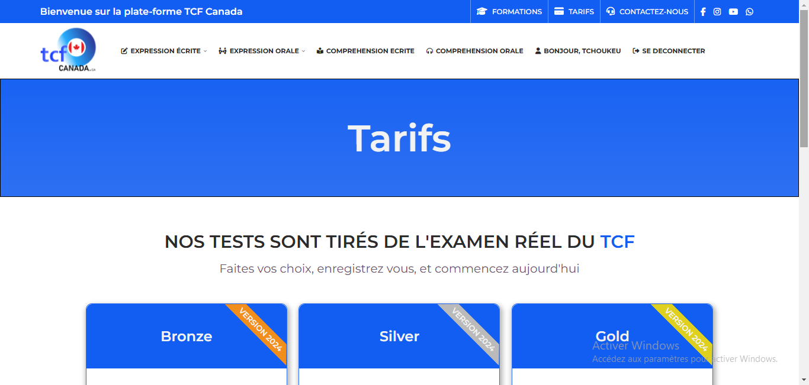
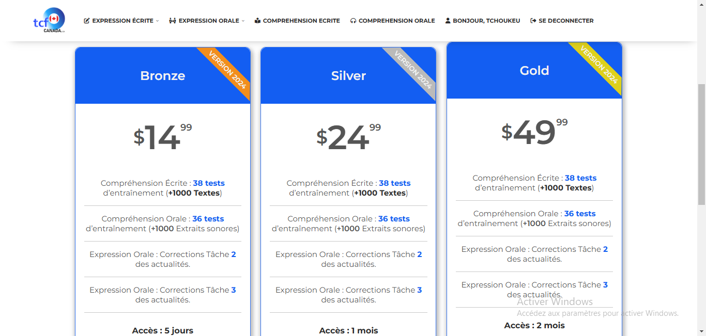

# web development assignment. Login part( this is a copy of a site to have courses to prepare for a Canadian language exam)

## Table of contents

- [Overview](#overview)
  - [The challenge](#the-challenge)
  - [Screenshot](#screenshot)
  - [Links](#links)
- [My process](#my-process)
  - [Built with](#built-with)
- [Author](#author)


## Overview

### The challenge

Users should be able to:

- View the optimal layout depending on their device's screen size
- See hover states for interactive elements

### Screenshot





### Links

- Live Site URL: [tcf canada tarifs]()

## My process

### Built with

- Semantic HTML5 markup
- CSS custom properties
- Flexbox


### What I learned

this is how I've done for make the ribborn.
```html
    <div class="head">
        Bronze
        <div class="bande">version 2024</div>
    </div>
```
```css
.bande{
    position: absolute;
    transform: rotate(45deg);
    clip-path: polygon(17.5% 0, 82.8% 0, 100% 100%, 0% 100%);
    width: 147px;
    font-size: 13px;
    right: -30px;
    top: 30px;
    text-transform: uppercase;
    padding: 5px;
}
```

## Author

- Frontend Mentor - [GraceAriane](https://www.frontendmentor.io/profile/GraceAriane)
- linkedIn - [Grace Ariane Tchoukeu](https://www.linkedin.com/in/grace-ariane-tchoukeu-a290b022a)